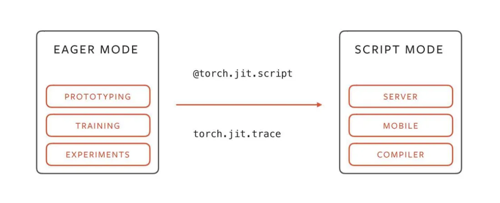

# Wiki-GRx-JIT



This repository provides the scripts and models for the Fourier Intelligence GRx Robot Model Repository.

## Description

The repository contains the following:

- **scripts**: Python scripts for generating the jit models.
- **models**: Neural network models for the robot controllers.

## User Guide

Run the following command to generate the robot models:

```
python jit.py
```

---

Thank you for your interest in the Fourier Intelligence GRx Robot Model Repository.
We hope you find this resource helpful in your robotics projects!