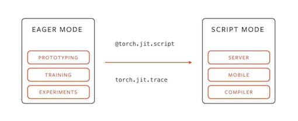

# Wiki-GRx-JIT



This repository provides the python scripts to generate the jit models for the Fourier Intelligence GRx Robot Model Repository.

## User Guide

1. Change the configuration of the policy model in the `jit.py` script, based on the controller policy model you used in the training.

```python
self.num_actor_obs = 39
self.num_critic_obs = 168
self.num_actions = 10
self.actor_hidden_dims = [512, 256, 128]
self.critic_hidden_dims = [512, 256, 128]
self.activation = "elu"
self.init_noise_std = 1.0
```

2. Run the following command to generate the robot models:

```
python jit.py <YOUR_MODEL_FILE>
```

---

Thank you for your interest in the Fourier Intelligence GRx Robot Model Repository.
We hope you find this resource helpful in your robotics projects!